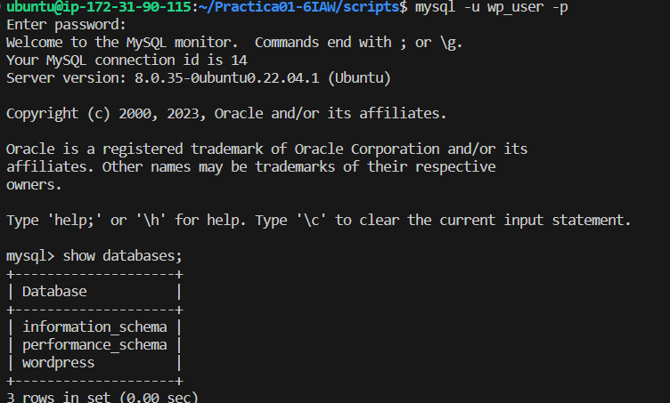
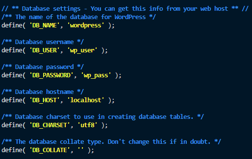

# Practica01-6IAW
Este repositorio es para la Práctica 1 apartado 6 de IAW

# Introducción.

- En esta práctica vamos a realizar la instalación de WordPress en una máquina de AWS con Sistema Operativo *_Ubuntu 22.04_*

## Antes de empezar.

- Tenemos que crear un repositorio en nuestra página de GitHub y una vez hecho eso clonarlo en nuestra máquina.

- Hacemos uso de `sudo apt install git`

- Después `git clone [URL del Repositorio]`

- Y comenzamos creando las carpetas *_scripts_* y *_conf_*.

# INSTALACIÓN DE WORDPRESS EN DIRECTORIO ROOT.

## Primeros pasos.

- Tendremos que coger el *_script_* de la instalación de la *_pila LAMP_* que hemos utilizado anteriormente y lo lanzamos con *_sudo_*

- `sudo ./install_lamp`


## Creamos el script *_DEPLOY_*

- Vamos a crear un script que nos permite la instalación de WordPress de manera automatica. 

- Primero tenemos que instalar unzip `sudo apt install unzip -y`

- El primer paso que tenemos que seguir es instalar el código fuente que sacamos de la URL de la pagina.

- `wget http://wordpress.org/latest.zip -P /tmp`

- Pero antes de eso, tenemos que eliminar instalaciones previas para así no tener que estar creando archivos cada vez que lancemos el *_script_*

- `rm -rf /tmp/latest.zip`

- Una vez lo tengamos instalado podemos hacer uso de `ls -l /tmp/` para ver que los archivos que tenemos dentro y observar que se ha descargado correctamente el zip.


## Descomprimimos el archivo haciendo uso de ZIP.

- Haciendo uso del comando : `unzip -u /tmp/latest.zip -d /tmp` podremos descomprimirlo. 

### SI USASEMOS TAR  Descomprimimos el archivo.

- Haciendo uso del comando `tar` tendremos que descomprimir el archivo que hemos descargado anteriormente. Esta linea tendremos que añadirla a nuestro script de *_deploy_wordpress_root_directory.sh_* 

- La linea que tenemos que añadir es:

    `tar -xzvf /tmp/latest.tar.gz -C /tmp`

## Parametros que utilizamos ( Si usasemos el comando tar)

    Utilizamos los siguientes parámetros:

    -x: Indica que queremos extraer el contenido del archivo.
    -z: Indica que queremos descomprimir el archivo.
    -v: Habilita el modo verboso para mostrar por pantalla el proceso de descompresión.
    -f: Se utiliza para indicar cuál es el nombre del archivo de entrada.
    -C: Se utiliza para indicar cuál es el diretorio destino.

- Información sacada de la página [JoseJuan](https://josejuansanchez.org/iaw/practica-01-06/index.html)

- Una vez hecho ya lo tenemos guardado en nuestro directorio *_/tmp/_*

## Es importante eliminar instalaciones previas para no saturarlo.

- Tenemos que eliminar las previas para no saturarlo, quiere decir que cada vez que ejecutemos el script, se irán descomprimiendo zips todo el rato en `\tmp\` y no queremos eso, por lo tanto añadiremos lo siguiente a nuestro script.

    ```
    # Antes de mover el contenido eliminamos instalaciones previas de WordPress en /var/www/html

    rm -rf /var/www/html/*
    ```

- De esta manera cada vez que queramos lanzar el script, previamente borraremos lo que haya en ese directorio. *_MUCHO OJO_* con hacerlo de manera correcta y no con `/html*` que borras todo el directorio.

- Como siguiente paso, lo único que tenemos que hacer es mover el directorio a la ruta que queremos que en este caso es `/var/www/html`. Lo hacemos con el siguiente comando que será la siguiente linea de nuestro script.

    ```
    #Movemos el contenido de /tmp/wordpress a /var/html

    mv -f /tmp/wordpress/* /var/www/html

    ```

## Creamos la base de datos y el usuario.

- Una vez realizados los pasos anteriores, tendremos que crear la base de datos como hemos hecho en prácticas anteriores a través del siguiente comando:

```

mysql -u root <<< "DROP DATABASE IF EXISTS $WORDPRESS_DB_NAME"
mysql -u root <<< "CREATE DATABASE $WORDPRESS_DB_NAME"
mysql -u root <<< "DROP USER IF EXISTS $WORDPRESS_DB_USER@$IP_CLIENTE_MYSQL"
mysql -u root <<< "CREATE USER $WORDPRESS_DB_USER@$IP_CLIENTE_MYSQL IDENTIFIED BY '$WORDPRESS_DB_PASSWORD'"
mysql -u root <<< "GRANT ALL PRIVILEGES ON $WORDPRESS_DB_NAME.* TO $WORDPRESS_DB_USER@$IP_CLIENTE_MYSQL"

```

- Recordemos que el signo `<<<` nos ayuda a ejecutar una serie de lineas dentro de nuestro MySql de manera automática cuando lanzamos el script.

- Si todo ha salido correctamente podemos acceder por consola a nuestro MySql y comprobar que todo se ha creado correctamente.

    


## Creamos el archivo wp-config.php

- Este archivo lo creamos a aprtir del ejemplo que es `wp-config-sample.php` entonces primero tenemos que hacer uso del comando `cp` para copiarlo y después añadimos el nombre del nuevo archivo.

    ``` 
    #Creamosnuestro archivo de configuración de WordPress.

    cp /var/www/html/wp-config-sample.php /var/www/html/wp-config.php

    ```
- Haciendo este paso, crearemos nuestro archivo  `.env` con la siguientes variables para que lo coja de manera automática al lanzar el script.

```
#Configuración de las variables
#-----------------------------------------------------

WORDPRESS_DB_NAME=wordpress
WORDPRESS_DB_USER=wp_user
WORDPRESS_DB_PASSWORD=wp_pass
WORDPRESS_DB_HOST=localhost
IP_CLIENTE_MYSQL=localhost

#-----------------------------------------------------
```

- Si ha sido configurado de manera correcta nos daremos cuenta que si buscamos el archivo en `var/www/html/wp-config.php` lo encontraremos con la siguiente información:

    

- Quiere decir que esta bien creado :D!!