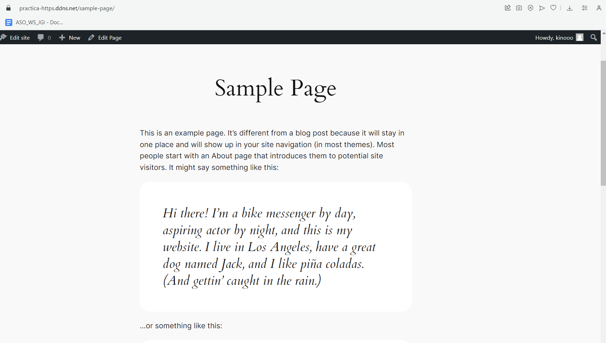

# Practica01-6IAW
Este repositorio es para la Práctica 1 apartado 6 de IAW

# Introducción.

- En esta práctica vamos a realizar la instalación de WordPress en una máquina de AWS con Sistema Operativo *_Ubuntu 22.04_*

## Antes de empezar.

- Tenemos que crear un repositorio en nuestra página de GitHub y una vez hecho eso clonarlo en nuestra máquina.

- Hacemos uso de `sudo apt install git`

- Después `git clone [URL del Repositorio]`

- Y comenzamos creando las carpetas *_scripts_* y *_conf_*.

# INSTALACIÓN DE WORDPRESS EN DIRECTORIO ROOT.

## Primeros pasos.

- Tendremos que coger el *_script_* de la instalación de la *_pila LAMP_* que hemos utilizado anteriormente y lo lanzamos con *_sudo_*

- `sudo ./install_lamp`


- Es muy importante tener 

## Creamos el script *_DEPLOY_*

- Vamos a crear un script que nos permite la instalación de WordPress de manera automatica. 

- Primero tenemos que instalar unzip `sudo apt install unzip -y`

- El primer paso que tenemos que seguir es instalar el código fuente que sacamos de la URL de la pagina.

- `wget http://wordpress.org/latest.zip -P /tmp`

- Pero antes de eso, tenemos que eliminar instalaciones previas para así no tener que estar creando archivos cada vez que lancemos el *_script_*

- `rm -rf /tmp/latest.zip`

- Una vez lo tengamos instalado podemos hacer uso de `ls -l /tmp/` para ver que los archivos que tenemos dentro y observar que se ha descargado correctamente el zip.


## Descomprimimos el archivo haciendo uso de ZIP.

- Haciendo uso del comando : `unzip -u /tmp/latest.zip -d /tmp` podremos descomprimirlo. 

### SI USASEMOS TAR  Descomprimimos el archivo.

- Haciendo uso del comando `tar` tendremos que descomprimir el archivo que hemos descargado anteriormente. Esta linea tendremos que añadirla a nuestro script de *_deploy_wordpress_root_directory.sh_* 

- La linea que tenemos que añadir es:

    `tar -xzvf /tmp/latest.tar.gz -C /tmp`

## Parametros que utilizamos ( Si usasemos el comando tar)

    Utilizamos los siguientes parámetros:

    -x: Indica que queremos extraer el contenido del archivo.
    -z: Indica que queremos descomprimir el archivo.
    -v: Habilita el modo verboso para mostrar por pantalla el proceso de descompresión.
    -f: Se utiliza para indicar cuál es el nombre del archivo de entrada.
    -C: Se utiliza para indicar cuál es el diretorio destino.

- Información sacada de la página [JoseJuan](https://josejuansanchez.org/iaw/practica-01-06/index.html)

- Una vez hecho ya lo tenemos guardado en nuestro directorio *_/tmp/_*

## Es importante eliminar instalaciones previas para no saturarlo.

- Tenemos que eliminar las previas para no saturarlo, quiere decir que cada vez que ejecutemos el script, se irán descomprimiendo zips todo el rato en `\tmp\` y no queremos eso, por lo tanto añadiremos lo siguiente a nuestro script.

    ```
    # Antes de mover el contenido eliminamos instalaciones previas de WordPress en /var/www/html

    rm -rf /var/www/html/*
    ```

- De esta manera cada vez que queramos lanzar el script, previamente borraremos lo que haya en ese directorio. *_MUCHO OJO_* con hacerlo de manera correcta y no con `/html*` que borras todo el directorio.

- Como siguiente paso, lo único que tenemos que hacer es mover el directorio a la ruta que queremos que en este caso es `/var/www/html`. Lo hacemos con el siguiente comando que será la siguiente linea de nuestro script.

    ```
    #Movemos el contenido de /tmp/wordpress a /var/html

    mv -f /tmp/wordpress/* /var/www/html

    ```

## Creamos la base de datos y el usuario.

- Una vez realizados los pasos anteriores, tendremos que crear la base de datos como hemos hecho en prácticas anteriores a través del siguiente comando:

    ```

    mysql -u root <<< "DROP DATABASE IF EXISTS $WORDPRESS_DB_NAME"
    mysql -u root <<< "CREATE DATABASE $WORDPRESS_DB_NAME"
    mysql -u root <<< "DROP USER IF EXISTS $WORDPRESS_DB_USER@$IP_CLIENTE_MYSQL"
    mysql -u root <<< "CREATE USER $WORDPRESS_DB_USER@$IP_CLIENTE_MYSQL IDENTIFIED BY '$WORDPRESS_DB_PASSWORD'"
    mysql -u root <<< "GRANT ALL PRIVILEGES ON $WORDPRESS_DB_NAME.* TO $WORDPRESS_DB_USER@$IP_CLIENTE_MYSQL"

    ```

- Recordemos que el signo `<<<` nos ayuda a ejecutar una serie de lineas dentro de nuestro MySql de manera automática cuando lanzamos el script.

- Si todo ha salido correctamente podemos acceder por consola a nuestro MySql y comprobar que todo se ha creado correctamente.

    


## Creamos el archivo wp-config.php

- Este archivo lo creamos a aprtir del ejemplo que es `wp-config-sample.php` entonces primero tenemos que hacer uso del comando `cp` para copiarlo y después añadimos el nombre del nuevo archivo.

    ``` 
    #Creamosnuestro archivo de configuración de WordPress.

    cp /var/www/html/wp-config-sample.php /var/www/html/wp-config.php

    ```


## Hacemos uso del comando *_SED_*
- Para después de generar el archivo anterior nos lo encontraremos de la siguiente manera: 

    ```
    // ** Database settings - You can get this info from your web host ** //
    /** The name of the database for WordPress */
    define( 'DB_NAME', 'database_name_here' );

    /** Database username */
    define( 'DB_USER', 'username_here' );

    /** Database password */
    define( 'DB_PASSWORD', 'password_here' );

    /** Database hostname */
    define( 'DB_HOST', 'localhost' );

    /** Database charset to use in creating database tables. */
    define( 'DB_CHARSET', 'utf8' );

    /** The database collate type. Don't change this if in doubt. */
    define( 'DB_COLLATE', '' );
    ```


- Lo que tenemos que hacer es usar el famoso comando *_sed -i_* para que busque la cadena que queremos y aplique cambios para siempre, lo haremos usando el siguiente bloque de comandos: 

    ```

    sed -i "s/database_name_here/$WORDPRESS_DB_NAME/" /var/www/html/wp-config.php
    sed -i "s/username_here/$WORDPRESS_DB_USER/" /var/www/html/wp-config.php
    sed -i "s/password_here/$WORDPRESS_DB_PASSWORD/" /var/www/html/wp-config.php
    sed -i "s/localhost/$WORDPRESS_DB_HOST/" /var/www/html/wp-config.php

    ```


- El siguiente paso, crearemos nuestro archivo  `.env` con la siguientes variables para que lo coja de manera automática al lanzar el script.

    ```
    #Configuración de las variables
    #-----------------------------------------------------

    WORDPRESS_DB_NAME=wordpress
    WORDPRESS_DB_USER=wp_user
    WORDPRESS_DB_PASSWORD=wp_pass
    WORDPRESS_DB_HOST=localhost
    IP_CLIENTE_MYSQL=localhost

    #-----------------------------------------------------
    ```
    

- Si ha sido configurado de manera correcta nos daremos cuenta que si buscamos el archivo en `var/www/html/wp-config.php` lo encontraremos con la siguiente información:

    

- Quiere decir que esta bien creado :D!!

## Permisos para el usuario www-data.

- Una de las cosas mas importantes es que al final de cada script declaremos los permisos correspondientes para el usuario *_www:data_* por lo tanto añadiremos la ultima línea que será la siguiente: 

    `chown -R www-data:www-data /var/www/html/`


- Podemos probar el acceso con nuestra *_IP_* y nos debería salir de la siguiente manera: 

    


## Finalizamos el directorio de root.

- Nos faltaba por añadir al *_script_* una serie de lineas que hemos añadido en el directorio propio, las cuales son:

    ```
    #Copiamos el archivo .htaccess

    cp ../htaccess/.htaccess /var/www/html/
    

    # Habilitamos el módulo mod_rewrite de Apache.

    a2enmod rewrite

    #Reiniciamos el apache2

    sudo systemctl restart apache2

    ```

- Al estar bien configurado, si lanzamos de nuevo el *_script_* con nombre *_deploy_wordpress_root_directory.sh_*  y accedemos a nuestro sitio web. *_Nombre del dominio_*

- Nos debera de volver a pedir la instalación, configuración de los enlaces permanentes y que podamos hacer como al final de la practica de *_su propio directorio_*

- Aqui adjunto una captura después de haberlo instalado de nuevo, configurado los enlaces permanente y dentro del post *_Hola Mundo!_*

    

# Configuración de WordPress en su propio directorio.

- Para configurarlo en su directorio primero tendremos que añadir un script más con el siguiente nombre: *_deploy_wordpress_own_directory.sh_* de esta manera indicaremos que vamos ha realizar la misma descarga dentro de su propio directo.

1. Podemos copiar directamente las lineas del script anterior pero realizando una serie de cambios, basicamente por que el directorio donde queremos depositar el .zip es ahora en `/var/www/html/wordpress`

2. Eliminamos instalaciones previas del *_.zip_* para que no haya problemas mas adelante ;). 
    ``` 
    #Eliminamos instalaciones previas 

    rm -rf /tmp/latest.zip`
    ```
3. Una vez hayamos hecho esto, tendremos que descargar el zip y descomprimirlo en el nuevo directorio personal de esta ruta.

    ```
    #Descargamos la última versión de WordPress con el comando wget.

    wget http://wordpress.org/latest.zip -P /tmp


    # Instalamos unzip 

    sudo apt install unzip -y

    #Ejecuto el comando zip para descomprimirlo.

    unzip -u /tmp/latest.zip -d /tmp/wordpress/


    ```

- Como podemos observar la nueva ruta añade un `/wordpress` al final en comparación a la anterior.

4. El siguiente paso de la instalación será hacer el `mv` del `/tmp/wordpress` a su nueva ruta `/var/www/html`

    ```
    #Antes de mover el contenido eliminamos instalaciones previas de WordPress en /var/www/html

    rm -rf /var/www/html/*

    #Movemos el contenido de /tmp/wordpress a /var/html

    mv -f /tmp/wordpress/* /var/www/html

    ```
## Configuración del archivo 000-default.cnf y 000-default-le-ssl.conf

- Estos archivos forman parte del directorio `/etc/apache2/sites-availables` y realmente nos permite modificar los paramentros de Apache2.

- En el *000-default.cnf* tendremos que tenerlo de la siguiente manera: 
    ```
    <VirtualHost *:80>
    #ServerName www.example.com
    ServerAdmin webmaster@localhost
    DocumentRoot /var/www/html
    DirectoryIndex index.php index.html
    <Directory "/var/www/html">
        AllowOverride All
    </Directory>

    ErrorLog ${APACHE_LOG_DIR}/error.log
    CustomLog ${APACHE_LOG_DIR}/access.log combined
    </VirtualHost>
    ```

- Aquí la regla mas importanet que hemos añadido es un *_DirectoryIndex_* para indicar el orden en el que queremos que se ejecuten los index.

- AllowOverrider All: Que nos permite controlar que directivas queremos que se ejecuten dentro del directorio `.htaccess` que crearemos más adelante.

- Encontramos también un archivo llamado *000-default-le-ssl.conf*  el cual tendrá el siguiente aspecto.

    

- Donde observamos una serie de párametros como habilitar todas las conexiones a través del puerto 443. Tenemos que tener en cuenta que este archivo de configuración debera de crearse de manera automatica una vez que lancemos el script de own_directory y setup_lestencrypt_certificate.

## Configuración previa al lanzamiento de la base de datos (En mi caso).

- Anteriormente creamos un dominio a través de la página [No-IP](https://www.noip.com/es-MX/remote-access?gclid=Cj0KCQiAuqKqBhDxARIsAFZELmLrFciYlghwJ-PNANTkBCdG-KCidAXGehS_9ZOXwI3x48U0VKl_UDQaAh1zEALw_wcB&utm_campaign=free-dynamic-dns&utm_medium=cpc&utm_source=google) pero si nos damos cuenta, ese mismo dominio tiene asociada una IP antigua, es decir, de otra máquina. Por lo tanto si queremos utilizarlo y hacer uso de él en esta, tenemos que entrar y modificar la ip.

- Proceso bastante sencillo, solo iniciamos sesión y pulsamos en el apartado `modificar`. 

    

- Validamos la información y ya estaría listo.


## Creación de la base de datos y usuarios, pero en el directorio de WordPress.

- Siguiendo el comando anterior y con las modificaciones que hemos realizado anteriormente en nuestro archivo *_.env* podemos usar el mismo comando para crear la base de datos, pero después tendremos que seguir una serie de pasos.

    ```
    #Creamos la base de datos y el usuario para WordPress.
    mysql -u root <<< "DROP DATABASE IF EXISTS $WORDPRESS_DB_NAME"
    mysql -u root <<< "CREATE DATABASE $WORDPRESS_DB_NAME"
    mysql -u root <<< "DROP USER IF EXISTS $WORDPRESS_DB_USER@$IP_CLIENTE_MYSQL"
    mysql -u root <<< "CREATE USER $WORDPRESS_DB_USER@$IP_CLIENTE_MYSQL IDENTIFIED BY '$WORDPRESS_DB_PASSWORD'"
    mysql -u root <<< "GRANT ALL PRIVILEGES ON $WORDPRESS_DB_NAME.* TO $WORDPRESS_DB_USER@$IP_CLIENTE_MYSQL"
    ```

- Las variables ya deberían de estar configuradas en nuestro archivo .env.

- Volvemos hacer uso del comando *_sed -i_* para configurarlo mismo que anteriormente pero en este caso lo que cambia es la ruta de donde estamos buscando cambiar la configuración.


    ```
    sed -i "s/database_name_here/$WORDPRESS_DB_NAME/" /var/www/html/wordpress/wp-config.php
    sed -i "s/username_here/$WORDPRESS_DB_USER/" /var/www/html/wordpress/wp-config.php
    sed -i "s/password_here/$WORDPRESS_DB_PASSWORD/" /var/www/html/wordpress/wp-config.php
    sed -i "s/localhost/$WORDPRESS_DB_HOST/" /var/www/html/wordpress/wp-config.php

    ```

- Si buscasemos el archivo que hemos configurado, nos saldrán las variables como la captura que hemos colocado arriba anteriormente al instalarlo fuera del directorio de WordPress.


## Configuramos las nuevas variables.

- Tenemos que configurar dos nuevas variables `WP_SITEURL` Y `WP_HOME` del archivo `wp-config.php`, que hemos creado anteriormente haciendo uso de:

    ```
    #Creamos nuestro archivo de configuración de WordPress.

    cp /var/www/html/wordpress/wp-config-sample.php /var/www/html/wordpress/wp-config.php

    ```

- Ahora haciendo uso del comando *_sed -i_* de la siguiente manera: Podemos observar un nuevo parámetro que aparece que `/a`. Este parámetro lo que hace es que "añade" lo que le digamos en el comando, En este caso `define(WP_SITEURL)` como por ejemplo.

    ```
    sed -i "/DB_COLLATE/a define('WP_SITEURL', 'http://$CERTIFICATE_DOMAIN/wordpress');" /var/www/html/wordpress/wp-config.php
    sed -i "/WP_SITEURL/a define('WP_HOME', 'http://$CERTIFICATE_DOMAIN');" /var/www/html/wordpress/wp-config.php


    ```
- Si lanzamos el script deberían de verse de la siguiente manera si hacemos un `cat` de la ruta siguiente `var/html/wordpress/wp-config.php`

    

- Como bien dice en la página de [Jose Juan, apartado 1.4.8](https://josejuansanchez.org/iaw/practica-01-06/index.html) tendremos que tener la variable `CERTIFICATE_DOMAIN` configurada en nuestro *_.env_*

    ```
    #Variables de la Practica 5.

    CERTIFICATE_EMAIL=demo@demo.es
    CERTIFICATE_DOMAIN=practica-https.ddns.net

    ```

- Por último hacemos un `cp` para mover el archivo al directorio principal de apache `/var/www/html`

   ``` 
   
   # Copiamos el archivo /var/www/html/wordpress/index.php a /var/www/html

    cp /var/www/html/wordpress/index.php /var/www/html

   ```

## Editamos el archivo index.php

- Tenemos que editar este archivo para continuar con la configuración de la práctica, lo haremos añadiendo la siguiente linea al script:

    `sed -i "s#wp-blog-header.php#wordpress/wp-blog-header.php#" /var/www/html/index.php`


## Habilitamos el módulo `mod_rewrite`.

- mod_rewrite de Apache es una forma efectiva y fácil de manipular URLs. La manipulación de una URL se realiza desde el lado del servidor. Explicado de forma básica, con mod_rewrite, las URLs limpias y fáciles de usar se convierten en sitios web. Como su nombre lo indica, este módulo realiza una reescritura de las URLs.


- Lo habilitamos de la manera en la que habilitamos el resto de módulos, haciendo uso de `a2enmod` y el nombre del módulo.

    `a2enmod rewrite`

# IMPORTANTE.

- El siguiente paso que tenemos que añadir en el script es el siguiente: Crear un archivo `.htaccess` en el caso de que no lo hayamos creado y si no, añadir ese archivo.

- Si tenemos que crear el script desde el principio tendremos que añadir el siguiente archivo.

    ```
     # BEGIN WordPress
    <IfModule mod_rewrite.c>
    RewriteEngine On
    RewriteBase /
    RewriteRule ^index\.php$ - [L]
    RewriteCond %{REQUEST_FILENAME} !-f
    RewriteCond %{REQUEST_FILENAME} !-d
    RewriteRule . /index.php [L]
    </IfModule>
    # END WordPress 
    ```

- Para añadirlo al script tendremos que hacer lo siguiente: `cp ../htaccess/.htaccess /var/www/html/`

- También sera muy muy importante tener configurado de manera correcta nuestro archivo *000-default.conf* para su correcto funcionamiento. 

- Es muy importante que el módulo ALLOWOVERRIDE ALL este áctivo.

## Explicación de las reglas que estamos ejecutando anteriormente en el archivo *_.htaccess_*

- Las reglas que hemos aplicado anteriormente tienen su explicación en el [Apartado 1.4.12 de Documentación de Jose Juan](https://josejuansanchez.org/iaw/practica-01-06/index.html). 

- Las reglas serán las siguientes: 

   

# Resolución de la práctica.

- En el caso de que se haya configurado de manera correcta, podremos acceder a nuestro nombre de dominio en la URL y nos redirige a la página de WordPress.

- Nos regitramos y nos damos cuenta que podemos acceder a nuestro usuario.


- Si accedemos al apartado llamado *_Ejemplo de página_* nos encontraremos que podemos acceder y en la URL se añadirá la página.

    

- Al igual que poder descargarnos el tema que queramos y poder acceder también al apartado *HOLA MUNDO!* y que entremos de manera correcta.

     